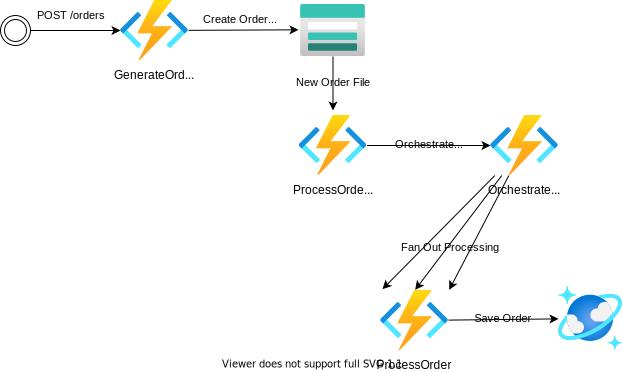

# Durable Function Blob Fan Out

An example of an Azure Durable Function that reads a blob file and fans out the processing.

## Architecture



Process:

1. Send a POST /orders to generate a new Orders file and save it to storage.
1. New files are processed and the array of orders is sent on to the Durable Functions orchestrator.
1. The orchestrator fans out a request to the ProcessOrder function for each order in the array.
1. The ProcessOrder function saves the order to the database.

## Settings

The following settings are required to run the Function App locally in a **local.settings.json** file:

```json
{
  "IsEncrypted": false,
  "Values": {
    "AzureWebJobsStorage": "[storage_account_connection_string]",
    "FUNCTIONS_WORKER_RUNTIME": "dotnet",
    "BlobConnection": "[storage_account_connection_string]",
    "BlobInputPath": "orders/input",
    "CosmosConnection": "[cosmos_connection_string]",
    "DatabaseName": "Sales",
    "CollectionName": "Orders"
  }
}
```
